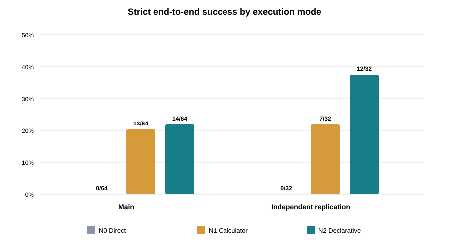
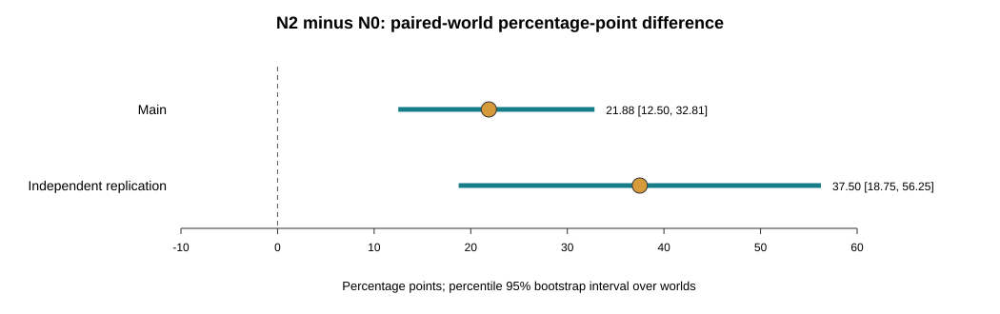

# SplitSense-Bench: Separating Data-Science Reasoning from Numerical Execution

**Public technical report — v1.0.0, 2026-09-21 · Ouyang Kuang**

## Abstract

Data-science agents must identify which validation evidence matches a deployment setting, bind it to the right candidates, and execute the resulting numerical decision without transcription or arithmetic failure. SplitSense-Bench studies this evidence-to-execution chain. Diagnostic-D2 compared direct vector output (N0), calculator assistance followed by vector output (N1), and a restricted declarative executor that applies an Agent-locked evidence plan without correcting its meaning (N2). The jointly registered study contained 32 main worlds, 16 independent replication worlds, two deployments per world, and 336 total formal sessions including repeats. In main, strict end-to-end success was 0/64 for N0, 13/64 for N1, and 14/64 for N2. N2 minus N0 was +21.88 percentage points with a paired-world bootstrap 95% interval of [12.50, 32.81]. In replication, success was 0/32, 7/32, and 12/32; N2 minus N0 was +37.50 points [18.75, 56.25]. N2 minus N1 was not established because both intervals crossed zero. The result supports execution assistance within this registered synthetic task, not stronger underlying model reasoning, real-world deployment-risk validity, Track A model-selection reliability, or cross-domain generalization. We provide an anonymized offline reproduction layer and a key-free toy executor demo while retaining private episodes, hidden outcomes, and generation seeds outside the public package.

## 1. Motivation

Validation results become useful only when they match the setting in which a model will operate. A data-science Agent may receive evidence from populations represented and unrepresented in training, a deployment mixture, and a fixed candidate list. It must decide which evidence belongs to which population, assign correct weights, preserve candidate identity, perform arithmetic, and deliver a complete vector. A failure at any stage can invalidate the output even if another stage was correct.

SplitSense separates validation evidence, Agent reasoning, and reliable execution. This Track B question differs from Track A, which asks whether a validation strategy changes model ranking, selection, and deployment loss. Diagnostic-D2 cannot substitute for that unresolved model-selection question.

## 2. Related work

Program-aided language models (PAL) delegate the solution step of generated programs to an external runtime, while Program of Thoughts (PoT) similarly separates program-like reasoning from computation [1,2]. These precedents prevent SplitSense from claiming that tool-assisted calculation is itself new. SplitSense measures a narrower question: whether a bounded executor helps complete a validation-evidence task after the Agent chooses the semantics.

Tool-agent benchmarks distinguish trajectory validity from final state. tau-bench evaluates final database state and repeated-trial reliability, while ToolSandbox uses stateful execution and intermediate and final milestones [3,4]. These designs motivate strict end-state scoring and repeat analysis. SplitSense is smaller and synthetic and does not reproduce their conversational or real-software scope.

Deployment-aware validation has older statistical foundations. Importance-weighted cross-validation adjusts validation toward a target input distribution under covariate shift, while earlier weighted predictive inference formalized target-versus-observed covariate distributions [5,6]. SplitSense's two-pool mixture is not a new estimator. DSEval evaluates broader data-science-agent workflows [7]; SplitSense instead isolates evidence semantics and numerical delivery. This is a targeted prior-work check, not a systematic review or a global first-of-kind claim.

## 3. Research question

The primary question was whether restricted declarative execution (N2) improves strict complete delivery relative to direct numerical output (N0) under a frozen validation-risk task and model. A jointly registered independent batch tested whether the direction reappeared on new worlds. N1 calculator assistance was secondary. The study did not test whether the risk vector predicts hidden real-world deployment loss.

## 4. SplitSense task

Each synthetic world contained 12 fixed candidate predictors and two visible validation-risk pools. One pool contained entities represented in training and the other unseen entities. A deployment contract provided `alpha`, the represented-entity fraction. For candidate `c`, the visible target was

`T_c = alpha * r_seen,c + (1 - alpha) * r_unseen,c`,

where `r_seen,c` and `r_unseen,c` are exactly the serialized values shown to the Agent. With submitted risk `R_hat_c` and positive training variance `V`, normalized component error was `e_c = abs(R_hat_c - T_c) / V`. The frozen tolerance was `tau = 1e-4`. Semantic indicator `P` required correct evidence references, candidate binding, and weights. The strict endpoint was

`J_D2 = valid_lock AND P AND max_c(e_c) <= tau`.

Every assigned session remained in its condition denominator. Invalid continuous metrics were missing rather than zero-filled.

## 5. D1 failure diagnosis

Diagnostic-D1 had produced zero complete vectors in 432 primary sessions. Before D2, the project reconstructed the evidence, serialization, locking, and scoring chain. All 48 independent Decimal references matched, all 144 interface paths accepted correct reference submissions, 19 new negative and edge controls behaved as expected, and all targets were attainable at three output decimals under the frozen tolerance. No tested precision, order, binding, or scoring defect explained the zero result.

Across 540 D1 terminal records, earliest observable failures were 134 lock or structure failures, 168 semantic weight failures, 235 cases where numerical execution and candidate binding could not be separated, one incomplete acquisition, and two transport/resource failures. Of 432 primary sessions, 324 had valid vectors and 184 had correct weights, but none of those 184 passed all 12 components. This post-hoc decomposition retained uncertainty about unlogged steps and did not rescore D1 into a new experiment.

## 6. N0, N1, and N2

**N0 — Direct output.** The Agent selected evidence and weights and directly emitted the full risk vector. The program only validated and locked it.

**N1 — Calculator assistance.** The Agent selected evidence, weights, and candidate-level calculations. A bounded calculator executed legal arithmetic, after which the Agent submitted the vector.

**N2 — Declarative execution.** The Agent submitted evidence references, candidate mappings, and weights. A restricted executor applied that exact plan and emitted an immutable vector with provenance hashes. It did not receive hidden answers, infer the correct mixture, or repair incorrect semantics. A legal but wrong plan was executed and scored as wrong.

N1 and N2 are Agent-plus-executor systems. Their contrast includes binding, transcription, and output-format burdens and is not a pure arithmetic effect.

## 7. Experimental design

The main batch contained 32 new worlds, two deployments, and three conditions: 192 sessions. Replication contained 16 additional worlds with the same structure: 96 sessions. A repeat batch reran all conditions on two deployments for eight preselected main worlds: 48 sessions. Total formal sessions were 336.

All batches were registered before outcomes. Prompt, model identifier, generator, executor sources, candidate library, endpoint, tolerances, order, and analysis were frozen. The model identifier was `openai/gpt-5.4-nano-2026-03-17`. Scores remained undisclosed until every session was terminal. Terminals were 259 locked, 29 invalid, 19 resource-failed, and 29 unknown-delivery. Unknown deliveries were never retried.

The independent unit was the world. Each world's two deployment-level differences in `J_D2` were averaged. The report uses 20,000 paired-world percentile bootstrap resamples, with seeds 2026092102 for main and 2026092103 for replication. Batches are reported separately.

## 8. Main results

Main strict success was 0/64 (0.00%) for N0, 13/64 (20.31%) for N1, and 14/64 (21.88%) for N2. N2 minus N0 was +21.88 points [12.50, 32.81]. N1 minus N0 was +20.31 [10.94, 29.69]. N2 minus N1 was +1.56 [-10.98, 14.06].

N0 often selected correct semantics but failed the full vector: main `P` was 25/64 while strict success was 0/64. In N1 and N2, every strict success coincided with `P` success. The gain lies in the full evidence-to-number delivery chain, but the design does not isolate one causal subcomponent.

## 9. Independent replication

Replication success was 0/32 (0.00%) for N0, 7/32 (21.88%) for N1, and 12/32 (37.50%) for N2. N2 minus N0 was +37.50 points [18.75, 56.25]. N1 minus N0 was +21.88 [6.25, 43.75]. N2 minus N1 was +15.63 [-6.25, 37.50].

The independent batch reproduced the positive direction of both assisted conditions relative to direct output. It did not establish N2 over N1 because both N2-minus-N1 intervals crossed zero.

## 10. Failure and repeat analysis

Across 48 preplanned repeat pairs, one was `SAME_CORRECT`, three `SAME_WRONG`, 27 `DIFFERENT`, and 17 had at least one missing valid vector. Repeatability of a wrong vector is not correctness. The large different and missing categories show instability in single-run outcomes.

Resource failures, invalid outputs, and unknown deliveries remained failures in assigned denominators. Continuous error summaries condition on valid locks and cannot be treated as if conditions had the same selected population.

## 11. Reusable executor

The key-free component exposes `plan -> execute -> locked artifact`. A task contains visible evidence hashes, candidates, pool order, and risks. A plan contains weights and evidence bindings. The executor accepts a bounded schema and arithmetic, rejects unauthorized references, duplicate coverage, non-finite values, and malformed structures, returns `UNKNOWN` for missing information, and executes a valid semantic error unchanged.

Two clean processes verified correct execution, semantic-error preservation, permission rejection, and missing-information handling. Nineteen D2 tests and the earlier 48-case regression suite passed. The public `demo.py` uses toy values and is not a formal episode.

## 12. Limitations

The study uses one synthetic generator, one fixed 12-candidate library, one model identity, and one evidence interface. Replication changes worlds, not domains, models, or mechanisms. N2 is a system result, not evidence of stronger base-model reasoning. The study does not establish hidden deployment-risk accuracy, real-world utility, model-selection improvement, or Track A success.

N2 versus N1 is unresolved. Invalid and unknown-delivery rates differ by condition, and continuous metrics are selected by valid locking. No external human review or independent public reproduction has occurred. Public records omit raw prompts, responses, hidden outcomes, and generation seeds, so they reproduce published statistics rather than private episode provenance.

## 13. Reproducibility and public boundary

The public release uses standard-library Python. `python reproduce_public_results.py` reads anonymized records and reconstructs counts, within-world differences, and intervals. `python demo.py` executes a toy plan. Tests check exact frozen values.

Private formal episodes, raw transport envelopes, hidden outcomes, task-generation seeds, credentials, account identifiers, and local paths are excluded as `PRIVATE_EVIDENCE_NOT_PUBLIC`. The controlled repository retains hashes, manifests, and a completion audit. This makes the public analysis reproducible while leaving private-cloud episode provenance inside the controlled evidence boundary.

## 14. Historical context and next step

Track B progressed through risk-evidence studies and Diagnostics D1–D2. D2 reached a frozen result, independent replication, and reusable component. Track A remains inactive and unresolved. Publication-P1 packages the result without creating D3 or tuning the effect. A later Benchmark-B1 may publish a small frozen task set with separate semantic, execution, and end-to-end scores.

## References

1. Gao, L. et al. “PAL: Program-aided Language Models.” 2022. https://arxiv.org/abs/2211.10435
2. Chen, W. et al. “Program of Thoughts Prompting.” 2022. https://arxiv.org/abs/2211.12588
3. Yao, S. et al. “tau-bench.” 2024. https://arxiv.org/abs/2406.12045
4. Lu, J. et al. “ToolSandbox.” 2024. https://arxiv.org/abs/2408.04682
5. Sugiyama, M., Krauledat, M., and Müller, K.-R. “Covariate Shift Adaptation by Importance Weighted Cross Validation.” JMLR 8, 2007. https://www.jmlr.org/papers/v8/sugiyama07a.html
6. Shimodaira, H. “Improving Predictive Inference under Covariate Shift by Weighting the Log-Likelihood Function.” 2000. https://doi.org/10.1016/S0378-3758(00)00115-4
7. Zhang, Y. et al. “Benchmarking Data Science Agents.” 2024. https://arxiv.org/abs/2402.17168
